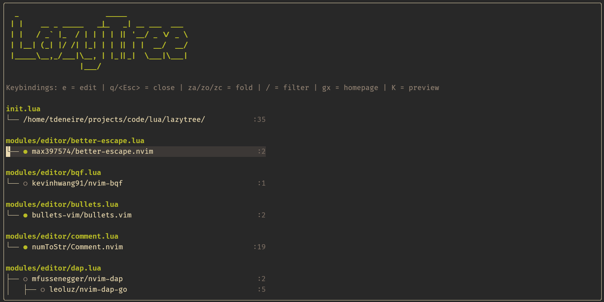

# 🌳 LazyTree

A Neovim plugin that gives you a tree-view map of all your [lazy.nvim](https://github.com/folke/lazy.nvim) plugin specs.

As your Neovim config grows, you can easily lose sight of the import order of plugins, or it becomes hard to see which file imports which plugins. LazyTree makes it easy to navigate your plugin configuration and helps you debug your config.



## ✨ Features

- 🔍 Scans your `init.lua` and all lazy.nvim spec directories
- 🌲 Shows plugins grouped by file in an interactive tree view
- 📦 Detects all lazy.nvim source formats: `"owner/repo"`, `dir = "..."`, `url = "..."`
- 🔗 Distinguishes plugins from their dependencies
- 🟢 Shows load status (loaded/not loaded) from lazy.nvim
- 🔄 Shows reverse dependencies (which plugins share a dependency)
- 📂 Fold/unfold file sections
- 🔎 Filter plugins by name
- ✏️ Open plugin spec files for editing (with `q` to return to the tree)
- 👀 Preview spec blocks with `K`
- 🌐 Open plugin homepages on GitHub with `gx`
- 🎨 All highlight groups are customizable

## 📥 Installation

With lazy.nvim:

```lua
{
    "tdeneire/lazytree",
    cmd = "LazyTree",
    opts = {},
}
```

## 🚀 Usage

```
:LazyTree
```

### ⌨️ Keybindings

| Key | Action |
|---|---|
| `e` | ✏️ Open the spec file at the plugin's line (editable, `q` returns to tree) |
| `q` / `<Esc>` | 🚪 Close the current window |
| `za` | 🔀 Toggle fold on file section |
| `zo` / `zc` | 📂 / 📁 Open / close fold |
| `/` | 🔎 Filter plugins by name |
| `gx` | 🌐 Open plugin homepage on GitHub |
| `K` | 👀 Preview the plugin's spec block |

## 🎨 Highlight Groups

All highlights link to standard groups by default and can be overridden:

| Group | Default | Used for |
|---|---|---|
| `LazyTreeHeader` | `Title` | ASCII art header |
| `LazyTreeFile` | `Directory` | File headings |
| `LazyTreeGlyph` | `NonText` | Tree-drawing characters |
| `LazyTreeLineNr` | `LineNr` | Line number suffixes |
| `LazyTreeFooter` | `Comment` | Keybindings bar |
| `LazyTreeLoaded` | `DiagnosticOk` | Loaded status indicator |
| `LazyTreeNotLoaded` | `Comment` | Not-loaded status indicator |
| `LazyTreeUsedBy` | `Special` | Reverse dependency annotations |
| `LazyTreeCursorGroup` | `CursorLine` | Cursor group highlight |

## 🤖 About

This plugin was entirely coded by [Claude](https://claude.ai) (Anthropic's AI assistant), with direction and testing by [@tdeneire](https://github.com/tdeneire).
